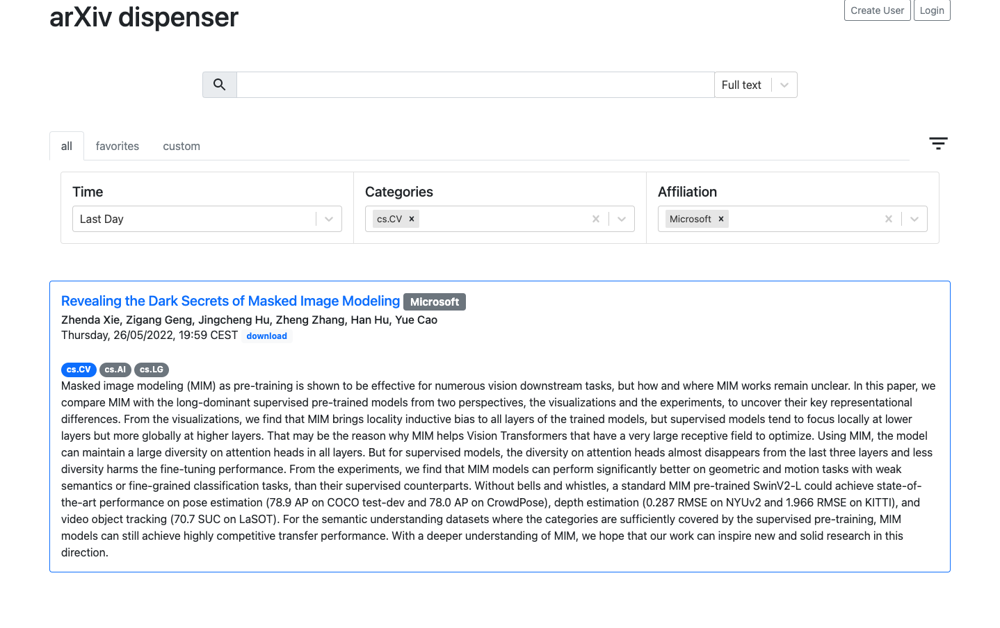

# arXiv dispenser

A web app to organize and filter through the daily flood of ML papers. Fetches
new papers daily from arXiv and allows to search by full-text and author, filter
by time, category, and author affiliation (based on pattern matching strings on
the first page of the papers). Allows users to create an account to then save
favorites and search queries. Easy to deploy with docker-compose. This project
is heavily inspired by the great
[arxiv-sanity](https://github.com/karpathy/arxiv-sanity-lite) project and is for
the most part just an excuse to futz around with React.



Features:

- Full-text and author search, based on tfidf
- Time, affiliation, and arXiv category filters
- Bookmark favorite papers
- Save search queries (The idea is to save all queries you care about with the
  time filter set to 'Last Day'. Then you can each day quickly scroll through
  all papers that came out on a topic (via full-text search query), in some
  subset of arXiv categories, or from an author or lab that you follow.

Todo:

- User-generated tags (will probably make saving favorites redundant)
- Order by
- More sophisticated time filters
- Show similar papers

## Getting started

This repo allows you to run your own `arXiv dispenser` instance. A Raspberry Pi
4 8GB should be sufficient to run an instance with one gunicorn worker and a
reasonably small number of papers served. No matter what you do, please be nice
and respect [arXiv's terms of use](https://arxiv.org/help/api/tou).

Use the following steps if you just want to spin up an `arXiv dispenser`
instance quickly. Otherwise, it is recommended to go through the configuration
section first.

```
git clone https://github.com/christophmeyer/arxiv-dispenser.git
```

```
cd arxiv-dispenser
```

```
docker-compose build
```

```
docker-compose up -d
```

Wait for the arxiv-dispenser-fetcher container to fetch the papers of the last
day (could be none, if on weekend/holiday). You can check the progress in the
logs with

```
docker logs -f arxiv-dispenser-fetcher
```

## Configuration

Configuration of the application is done in two places: the `config.yaml` in
`./config` and the `.env` file. If you make changes in either of these, while
the app is running you have to reload with

```
docker-compose up -d
```

### Session cookie secret

The salt used by Flask to sign the session cookie is set by `secret_key` in the
`config.yaml`. Set it to something long and hard to guess, e.g. generated with
`openssl rand -base64 32`.

### Database password

Change `db_password` in both the `config.yaml` and the `.env` file.

### Paper fetching parameters

In the `config.yaml` you can change some parameters about the daily fetching of
new papers (run in the `arxiv-dispatcher-fetcher` container) such as the
`daily_fetch_time`, and the arXiv `categories` to fetch papers from.

### Configure affiliations

For the extraction of affiliations, the first page of each paper is scanned for
matching patterns, which can be configured in
`./config/sample_affiliation.yaml`. There you can add the institutions you want
to follow/filter for.

### Frontend ports

Per default, the app serves http requests on port 80 and https on 443, which can
be changed in `.env`, by changing `FRONTEND_PORT` and `FRONTEND_PORT_TLS`.

For `TLS` you need to place a certificate in `./config/certs`. To generate a new
self-signed certificate you can use the rudimentary script in
`./backend/create_ssl_cert.sh`.

### Gunicorn workers / threads

The number of gunicorn workers and threads per worker can be configured in
`.env` with `GUNICORN_WORKERS` and `GUNICORN_WORKER_THREADS`. You can find more
information on this [here](https://docs.gunicorn.org/en/stable/design.html).
